# PadiPay 🚀

**Revolutionary Phone-Based Web3 Payments for Africa**

PadiPay is Africa's first phone number-based Web3 payment platform, allowing users to send cryptocurrency using phone numbers instead of complex wallet addresses. Built with ERC-4337 Account Abstraction on Morph blockchain, combining the simplicity of traditional mobile money with the power of DeFi.

[](https://nextjs.org/)
[](https://www.typescriptlang.org/)
[](https://soliditylang.org/)
[](https://morphl2.io/)
[](LICENSE)

## 🌟 Revolutionary Features

### 📱 Phone-Based Payments
- **Send Money by Phone Number** - No wallet addresses needed, just +1234567890
- **Auto-Wallet Creation** - Recipients get wallets automatically when they register
- **Smart Escrow System** - Funds held safely for 30 days if recipient hasn't registered
- **Universal Access** - Anyone with a phone number can receive crypto payments


### 🔐 Advanced Security Architecture
- **Phone Number Hashing** - Privacy-protected phone number mapping
- **ERC-4337 Account Abstraction** - Gasless transactions and advanced security
- **Smart Contract Audited** - Comprehensive testing with 12 test scenarios
- **Proxy Pattern Implementation** - Gas-efficient wallet creation (~100k vs 2M gas)

### 🌍 Built for Africa
- **Low Transaction Costs** - Morph L2 keeps gas fees under $0.50
- **Mobile-First Design** - Optimized for smartphone usage patterns
- **Offline-Ready** - Progressive Web App with offline capabilities
- **Multi-Currency Support** - NGN, USD, EUR, GHS, KES, ZAR, and more

## 🏗️ Technical Architecture

### Smart Contract System (Morph Blockchain)
```
├── PhoneRegistry.sol          # Phone number → Wallet mapping
├── SmartWallet.sol           # ERC-4337 compatible user wallets  
├── SmartWalletFactory.sol    # Gas-efficient wallet creation
├── EscrowVault.sol           # 30-day escrow for unregistered users
├── PadiPayCore.sol           # Main payment orchestrator
├── PaymasterContract.sol     # Optional gasless transactions
└── IERC20.sol + MockStablecoin.sol  # Token interfaces & testing
```

### Frontend Stack (Progressive Web App)
```
├── Next.js 13+ (App Router) with PWA Manifest
├── TypeScript 5.0+
├── Tailwind CSS 3.0+
├── Shadcn/UI Components
├── Web3 Integration (ethers.js)
├── Service Worker for Offline Support
├── Push Notifications API
├── Device API Integration (Camera, Contacts, Biometrics)
└── Native-like Mobile Experience
```

### Blockchain Infrastructure
```
├── Morph Holesky Testnet
├── Real USDT Integration (0x9E12AD42c4E4d2acFBADE01a96446e48e6764B98)
├── ERC-4337 EntryPoint (0x5FF137D4b0FDCD49DcA30c7CF57E578a026d2789)
├── Hardhat Development Environment
├── Comprehensive Test Suite
└── Production Deployment Scripts
```

## 🚀 Quick Start

### Prerequisites
- Node.js 18+ 
- npm, yarn, or pnpm
- Git
- MetaMask or compatible Web3 wallet

### Installation

1. **Clone the repository**
```bash
git clone https://github.com/Kanasjnr/padipay.git
cd padipay
```

2. **Install dependencies**
```bash
# Frontend
cd frontend
npm install

# Smart Contracts
cd ../contract
npm install
```

3. **Environment Setup**
```bash
# Frontend (.env.local)
NEXT_PUBLIC_APP_URL=http://localhost:3000
NEXT_PUBLIC_PHONE_REGISTRY_ADDRESS=0x...
NEXT_PUBLIC_PADI_PAY_CORE_ADDRESS=0x...
NEXT_PUBLIC_USDT_ADDRESS=0x9E12AD42c4E4d2acFBADE01a96446e48e6764B98
NEXT_PUBLIC_MORPH_RPC_URL=https://rpc-quicknode-holesky.morphl2.io

# Smart Contracts (.env)
PRIVATE_KEY=your-private-key-here
MORPH_RPC_URL=https://rpc-quicknode-holesky.morphl2.io
```

4. **Compile & Test Smart Contracts**
```bash
cd contract
npx hardhat compile
npx hardhat test
```

5. **Deploy Contracts (Testnet)**
```bash
npx hardhat run scripts/deploy.ts --network morphHolesky
```

6. **Start Frontend**
```bash
cd ../frontend
npm run dev
```

Visit [http://localhost:3000](http://localhost:3000) to see the application.

## 💡 How It Works

### 📱 User Registration Flow

```mermaid
graph TD
    A[User enters phone number] --> B[Hash phone number for privacy]
    B --> C[Create ERC-4337 smart wallet]
    C --> D[Register phone → wallet mapping]
    D --> E[User can send/receive payments]
```


### 💸 Payment Flow

#### Registered Recipient (Instant Transfer)

```mermaid
graph TD
    A[Alice sends $100 to +1234567890] --> B[Check phone registry]
    B --> C[Bob's wallet found]
    C --> D[Calculate fee: $2.00 2%]
    D --> E[Transfer $98 to Bob]
    E --> F[Transfer $2 fee to PadiPay]
    F --> G[Payment complete ✅]
```


#### Unregistered Recipient (Escrow)


## 📁 Project Structure

```
padipay/
├── frontend/                 # Next.js Frontend Application
│   ├── src/
│   │   ├── app/             # App Router pages & layouts
│   │   ├── components/      # React components
│   │   │   ├── auth/        # Authentication components
│   │   │   ├── forms/       # Form components & inputs
│   │   │   ├── transaction/ # Payment & transaction UI
│   │   │   ├── wallet/      # Wallet & dashboard components
│   │   │   └── ui/          # Reusable UI components
│   │   ├── lib/             # Utility libraries & Web3 integration
│   │   └── styles/          # Global styles & Tailwind config
│   └── public/              # Static assets & PWA manifest
├── contract/                # Smart Contract Development
│   ├── contracts/           # Solidity smart contracts
│   │   ├── PhoneRegistry.sol      # Core phone mapping
│   │   ├── SmartWallet.sol        # User wallet implementation
│   │   ├── SmartWalletFactory.sol # Wallet creation factory
│   │   ├── EscrowVault.sol        # Escrow system
│   │   ├── PadiPayCore.sol        # Payment orchestrator
│   │   ├── PaymasterContract.sol  # Gas sponsorship
│   │   ├── interfaces/            # Contract interfaces
│   │   └── test/                  # Mock contracts for testing
│   ├── scripts/             # Deployment & utility scripts
│   ├── test/                # Comprehensive test suite
│   ├── deployments/         # Deployment artifacts
│   └── hardhat.config.ts    # Hardhat configuration
└── README.md
```


### Gas Optimization
- **Wallet Creation**: ~100k gas (vs 2M without proxy pattern)
- **Payment Transaction**: ~50k gas average
- **Morph L2 Benefits**: 90% cheaper than Ethereum mainnet
- **Batch Operations**: Multiple payments in single transaction

## 🧪 Testing & Quality Assurance

### Smart Contract Testing
```bash
cd contract
npm run test
```

**Test Coverage:**
- ✅ Phone registration and duplicate prevention
- ✅ Wallet creation and initialization
- ✅ Direct payments between registered users
- ✅ Escrow system for unregistered recipients
- ✅ Fee calculation and minimum fee enforcement
- ✅ Access control and permission management
- ✅ Edge cases and error handling
- ✅ Gas optimization verification
- ✅ Integration testing across all contracts
- ✅ Revenue tracking and statistics

### Frontend Testing
```bash
cd frontend
npm run test        # Unit tests
npm run test:e2e    # End-to-end tests
npm run test:api    # API integration tests
```

## 🚢 Deployment

### Smart Contract Deployment (Morph Holesky)
```bash
cd contract
npx hardhat run scripts/deploy.ts --network morphHolesky
```

**Deployed Contract Addresses:**
```env
PHONE_REGISTRY_ADDRESS=0x...
ESCROW_VAULT_ADDRESS=0x...
SMART_WALLET_IMPLEMENTATION=0x...
WALLET_FACTORY_ADDRESS=0x...
PADI_PAY_CORE_ADDRESS=0x...
PAYMASTER_CONTRACT_ADDRESS=0x...
USDT_ADDRESS=0x9E12AD42c4E4d2acFBADE01a96446e48e6764B98
```

### Frontend Deployment (Vercel)
```bash
cd frontend
vercel --prod
```

### Network Configuration
```typescript
// Morph Holesky Testnet
{
  chainId: 2810,
  name: 'Morph Holesky Testnet',
  currency: 'ETH',
  explorerUrl: 'https://explorer-holesky.morphl2.io',
  rpcUrl: 'https://rpc-quicknode-holesky.morphl2.io'
}
```

## 🔐 Security Features

### Smart Contract Security
- **Access Control**: Role-based permissions across all contracts
- **Reentrancy Protection**: Comprehensive reentrancy guards
- **Phone Number Privacy**: Cryptographic hashing prevents enumeration
- **Escrow Safety**: Time-locked refunds and automatic claiming
- **Fee Protection**: Minimum fee prevents economic attacks

### User Security
- **Biometric Authentication**: WebAuthn fingerprint/face recognition
- **Session Management**: Secure token handling and auto-logout
- **Data Encryption**: All sensitive data encrypted at rest
- **Transaction Signing**: Hardware wallet integration support
- **Audit Logging**: Comprehensive security event tracking

## 🌐 API Documentation

### Core Smart Contract Functions

#### PhoneRegistry
```solidity
function registerPhone(bytes32 phoneHash, address wallet) external
function getWallet(bytes32 phoneHash) external view returns (address)
function isRegistered(bytes32 phoneHash) external view returns (bool)
```

#### PadiPayCore  
```solidity
function sendPayment(
    bytes32 recipientPhoneHash,
    uint256 amount,
    address token
) external returns (bool success)

function calculateFee(uint256 amount) external view returns (uint256)
```

#### EscrowVault
```solidity
function deposit(
    bytes32 phoneHash,
    uint256 amount,
    address token,
    address sender
) external

function claimPayment(bytes32 phoneHash, address token) external
function refund(bytes32 phoneHash, address token) external
```

### Frontend Integration
```typescript
// Phone-based payment
const sendMoney = async (phoneNumber: string, amount: number) => {
  const phoneHash = hashPhoneNumber(phoneNumber)
  const tx = await padiPayCore.sendPayment(phoneHash, amount, USDT_ADDRESS)
  return await tx.wait()
}

// Check if phone is registered
const checkRegistration = async (phoneNumber: string) => {
  const phoneHash = hashPhoneNumber(phoneNumber)
  return await phoneRegistry.isRegistered(phoneHash)
}
```

## 🤝 Contributing

We welcome contributions! Please see our [Contributing Guide](CONTRIBUTING.md) for details.

### Development Workflow
1. Fork the repository
2. Create a feature branch (`git checkout -b feature/amazing-feature`)
3. Commit changes (`git commit -m 'feat: add amazing feature'`)
4. Push to branch (`git push origin feature/amazing-feature`)
5. Open a Pull Request

### Smart Contract Development
- Follow Solidity best practices and security patterns
- Add comprehensive tests for all new functionality
- Update deployment scripts for new contracts
- Document all public functions with NatSpec

## 🛣️ Roadmap

### Q4 2025 (Current Focus)
- [ ] testnet Mainnet deployment on Morph
- [ ] Enhanced PWA features (offline support, push notifications)
- [ ] Advanced biometric authentication
- [ ] Multi-language support (French, Swahili, Yoruba)

### Q1 2026
- [ ] Mainnet deployment on Morph
- [ ] Cross-chain payment support 
- [ ] Merchant payment solutions

### Q2 2026
- [ ] Enterprise B2B solutions
- [ ] Regulatory compliance tools
- [ ] Advanced security features

### Q3 2026
- [ ] AI-powered fraud detection
- [ ] Pan-African expansion

## 📊 Performance Metrics

### Smart Contract Performance
- **Wallet Creation**: ~100k gas (96% reduction vs full deployment)
- **Payment Transaction**: ~50k gas average
- **Escrow Operations**: ~70k gas
- **Fee Calculation**: Constant time O(1)

### Frontend Performance
- **LCP**: < 2.5s (Largest Contentful Paint)
- **FID**: < 100ms (First Input Delay)
- **CLS**: < 0.1 (Cumulative Layout Shift)
- **Bundle Size**: ~200KB gzipped

### Revenue Performance
- **Transaction Success Rate**: 99.9% target
- **Average Transaction Value**: $100 target
- **Monthly Active Users**: 1,000+ target
- **Revenue Per User**: $8/month target

## 🌍 African Market Impact

### Financial Inclusion
- **Reach**: 1.3 billion people across Africa
- **Mobile Penetration**: 80%+ smartphone adoption
- **Cost Reduction**: 50-70% cheaper than traditional remittances
- **Speed**: Instant transfers vs 3-7 days traditional

### Use Cases
- **Remittances**: Diaspora sending money home
- **Merchant Payments**: Small business transactions
- **P2P Transfers**: Friend and family payments
- **Savings**: Stablecoin savings accounts

## 📝 License

This project is licensed under the MIT License - see the [LICENSE](LICENSE) file for details.

## 📞 Support & Community

- **Documentation**: [docs.padipay.app](https://docs.padipay.app)
- **GitHub**: [github.com/Kanasjnr/padipay](https://github.com/Kanasjnr/padipay)
- **Discord**: [Join our community](https://discord.gg/padipay)
- **Twitter**: [@PadiPayApp](https://twitter.com/PadiPayApp)
- **Email**: support@padipay.app
- **Telegram**: [@PadiPayOfficial](https://t.me/PadiPayOfficial)


---

<div align="center">
  <h3>🚀 Revolutionizing African Payments with Web3 🌍</h3>
  <p><strong>Built with ❤️ by the PadiPay Team</strong></p>
  <p>Making cryptocurrency as easy as sending an SMS</p>
</div>
